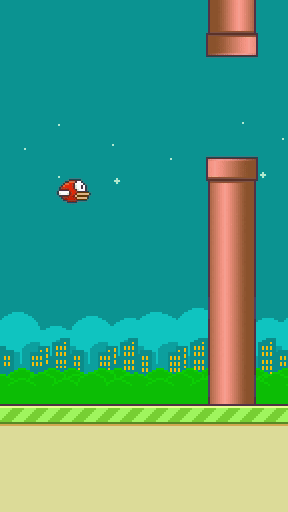

# Flappy-Bird
This a a flappy bird game made with pygame python module. It also includes an AI that solve the game using reinforcement learning with NEAT algorithme.

[](https://gitpod.io/#https://github.com/trapsidanadir/flappy-bird)

# Requirements
[Python 3.7](https://www.python.org/downloads/release/python-370/)

Usage of a virtual environement like [anaconda](https://www.anaconda.com/) or [venv](https://packaging.python.org/guides/installing-using-pip-and-virtual-environments/) is recomended

**No GPU or special hardware is required**

# Getting Started
Clone the repo
Install dependencies:
```sh
pip install -r requirements.txt
```

# Instructions

Just run the game *main.py* enjoy the game or watch the AI start training itself !

If you want to play yourself :
```sh
python .\main.py
```
If you want to train the ai to play:
```sh
python .\main.py ai
```
<p align="center">
  
</p>